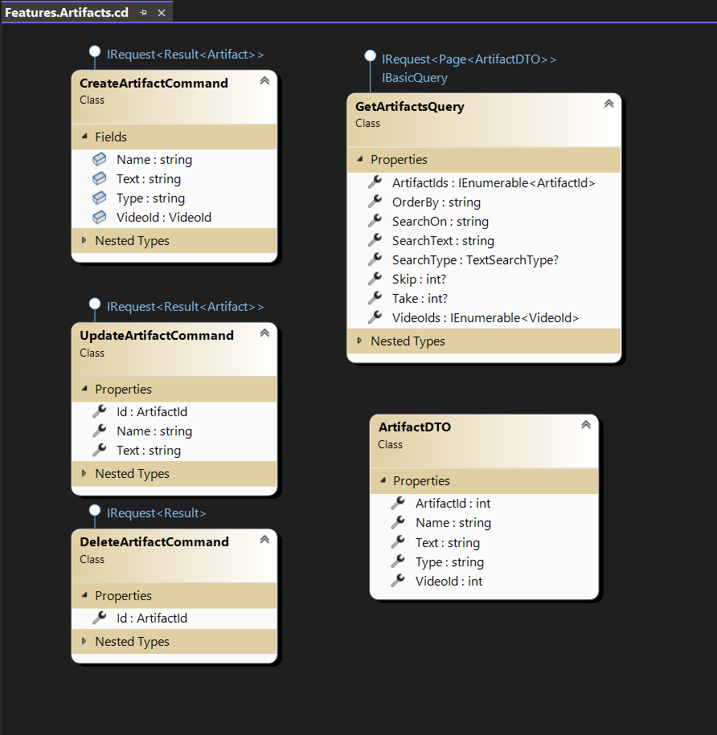

# Videomatic 

<div style="text-align:center;">
	
</div>

## A few introductory words
This project is still in its infancy and this documentation will be updated as soon as possible.

We believe we reached a good critical-point in which most (if not all) of the known problems either
have a solution or there's a plan/idea for it.

We didn't yet have enough time to write good documentation, but the diagrams below should provide a 
lot of information for anybody familiar with Clean Architecture and CQRS.

The files [DONE.txt](DONE.txt) and [TODO.txt.](TODO.txt) contain a list of items that have been completed or
are in the works.

Generally speaking, we reached the point in which true AI work can start and enough prototypes have been
completed to get more serious with AI.

*Our other repository [Semantic Kernel Winter Olympics](https://github.com/afederici75/SKWinterOlympics)
shows some our R&D.*

We opened this repository to the public because we have enough cooking to get to the point
of true integration with AI, using Microsoft's Semantic Kernel as the bridge to the LLM world.

Generally speaking, the code in this repositiory will be kept open and it's meant to be freely usable by anyone.


## A Video Analysis Companion

Videomatic (VM) revolutionizes the way you work with video and audio content. 

It's a specialized video processing system **designed to extract valuable insights from video and audio sources**.

Sources can be:
1. **Media streaming platforms** such as Youtube, Vimeo, etc.
1. **File sharing platforms** such Dropbox, Google Drive, etc.
1. **Local (private) data**

The **insights are generated using AI** and they are made accessible in the form of **text artifacts** such as:
1. A concise and clean **summary** of the video.
1. A **review** of the video based on factors such as its online comments or your personal preferences.
1. **Automatic cliff-notes** for the important parts of the video.
1. Links to similar videos, either online or in your VM collection.
1. User-defined AI prompts.
1. much more...

The material can then be refined and used to create your own output for blogs, social media, articles, etc.

```
Say goodbye to hours spent sifting through lengthy videos and writing your notes!
Videomatic condenses vast amounts of video data into concise and meaningful chunks of information. 
It does the heavy lifting, so you can focus on absorbing the content without worrying about taking notes.
```

### Import 4 Videos from YouTube

https://github.com/afederici75/Videomatic/assets/13766049/60b825f5-d7e5-441d-93cb-fc19ea60e12e


### Import 4 Playlists from YouTube

https://github.com/afederici75/Videomatic/assets/13766049/47140af1-88a5-462c-8e0a-48f4a2a504e8


But that's not all!

## An AI-Enhanced Search Engine

Videomatic also equips you with **powerful search capabilities**, allowing you to quickly find the information you 
need within your video library. 

Whether you're searching for specific keywords, phrases, or topics, Videomatic's intuitive search function makes 
knowledge retrieval a breeze. You can even use **natural language queries** to effortlessly navigate and explore 
your video collection.

```
Imagine watching a documentary or presentation and having all the key points automatically captured and cataloged 
for you. Then imagine being able to search through your entire video library using natural language queries.
```

Videomatic acts as your personal assistant, swiftly extracting crucial information from any video in a matter of 
seconds. It saves you valuable time, empowering you to build a comprehensive knowledge library that's easy to 
access, search, and share with others.

```
Experience the power of Videomatic and transform videos into actionable insights. 
Start harnessing the full potential of video content today.
```

[*** MAKE VIDEOS OF VECTOR/SEMANTIC SEARCH + AI Seracg / RAG ***]

## Developer Notes

1. **I temporarely disabled Semantic Search in order to make the videos. It will be re-enabled soon.
Search for GetVideosQueryHandler.cs in Infrastructure.Data.SqlServer AND Infrastructure.SemanticKernel**

1. This is a work in progress.
1. TODO.txt and DONE.txt show what's cooking and what's been done. *Q: Where should we put that stuff?*
1. This application is used to demonstrate various software development techniques, including 		
Clean Architecture (CA) and Command Query Responsibility Separation (CQRS).
1. Most of the techniques I used are based on articles and other resources online that should be credited. (*Ardalis*, *Bogard*, etc.*)
1. The application is built using .NET Core 7 but it will be shortly upgraded to 8-preview.
1. The Blazor client is barely started and I am rusty with HTML. (*Iain Wilson*, more?)
1. Most of the development time has been focused on creating a good server-side foundation (CA, CQRS, etc.).	
Most of the technology hurdles have been tested (e.g. can this be done? how?) but not finalized. **Look at the unit tests**.
1. **The Blazor project VideomaticRadzen needs a lot of work and it's very dirty**. Consider it an experiment.

### Vector Database


### RDBMS


## Diagrams

Most of the projects in this solution contain one or multiple class diagram files (*.cd) which 
can be used to understand the general direction of the project.

The following diagram shows the high level architecture of the solution.

<div style="text-align:center;">
	
</div>

The following pictures show more:

<div style="text-align:center;">
	
	
</div>

<div style="text-align:center;">
	
</div>

<div style="text-align:center;">
	
</div>

<div style="text-align:center;">
	
</div>

<div style="text-align:center;">
	
</div>

<div style="text-align:center;">
	
</div>

<div style="text-align:center;">
	
</div>

<div style="text-align:center;">
	
</div>

## Prerequisites

1. [Visual Studio Community Edition](https://visualstudio.microsoft.com/vs/community)
2. [Docker](https://www.docker.com/products/docker-desktop)
3. [*Optional*] [Microsoft SQL Server Management Studio]
	1. https://learn.microsoft.com/en-us/sql/ssms/download-sql-server-management-studio-ssms?view=sql-server-ver16#download-ssms

## Installation

The installation of MSSQL is a bit more laborious than it should be, but I wanted to test Full Text Search
first hand. 

```
The final product will either NOT use FT at all (since we have the vector search) or should be able to
work on any MSSQL image, not just 2019.

Depending on how we go with FT, I think VM's code will have 4 search "modes":
1. Classic SQL-like queries (SELECT ... FROM ... WHERE ...)
1. Full Text Search (FTS): FreeText and Contains
1. [Vector Search](https://www.elastic.co/what-is/vector-search) (Cosine/etc. similarity)
=======
I think VM will have 4 search modes at the end:
1. Classic SQL-like queries (SELECT ... FROM ... WHERE ...)
1. [Full Text Search]([url](https://learn.microsoft.com/en-us/sql/relational-databases/search/full-text-search?view=sql-server-ver16) (FTS): FreeText and Contains
1. [Vector Search]([url](https://www.algolia.com/blog/ai/what-is-vector-search/) 
1. [RAG Search (AI)](https://www.youtube.com/watch?v=poRHLfVWg7E)
```

### MSSQL Server 2019 with Full Text Search enabled

1. Build DOCKERFILE to create the image videomatic/mssql-fts (*this might take a few minutes*).
	1. *The image contains MSSQL Server 2019 with Full Text Search enabled*
	2. *More info [here](https://gianluigi.sellitto.it/2020/03/mssql-server-2019-on-docker-e-full-text-search/)*

```
> docker build -t videomatic/mssql-fts .
```

2. Start a container from the image we just created in step 1.
	1. *The container will be named mssql1 and will be listening on port 1433*
	2. **MAKE SURE YOU CHANGE THE PASSWORD**
```
> docker run -e "MSSQL_SA_PASSWORD=[your password here]" "ACCEPT_EULA=Y" -e -p 1433:1433 --name mssql1 --restart unless-stopped --hostname mssql1 -d videomatic/mssql-fts 
```

### REDIS Stack (Cache and Vector Database) in a friendly [web UI](http://localhost:8001/redis-stack/browser).

```
docker run -d --name redis-stack -p 6379:6379 -p 8001:8001 --restart unless-stopped redis/redis-stack:latest
```

### [Optional] SEQ (Logs from the application in a friendly [web UI](http://localhost/#/events).

```
docker run --name seq -d --restart unless-stopped -e ACCEPT_EULA=Y -p 80:80 -p 5341:5341 datalust/seq
```

## Configuration and User Secrets

The following projects use user secrets to store sensitive information.
1. Applications (VideomaticRadzen, VideomaticServiceImporter, VideomaticWebAPI)
1. Tests (Infrastructure.Tests)
 
This is an example of such secrets.json file. 

You will need to create your own and replace the values with your own.

```
{
  "ConnectionStrings:Videomatic.SqlServer": "Server=localhost;Database=Videomatic_Tests;User Id=sa;Password=...;TrustServerCertificate=True",
  //"ConnectionStrings:Videomatic.SqlServer": "Server=localhost;Database=Videomatic_BlazorDEV;User Id=sa;Password=...;TrustServerCertificate=True",
  //"ConnectionStrings:Videomatic.SqlServer": "Server=localhost;Database=Videomatic_FullTextTests;User Id=sa;Password=...;TrustServerCertificate=True",

  "YouTube:ServiceAccountEmail": "videomatic@xxxxx.iam.gserviceaccount.com",
  "YouTube:CertificatePassword": "...",

  "SemanticKernel:ApiKey": "sk-...", 

  "SemanticKernel:MemoryStoreEndpoint": "127.0.0.1:6379", // REDIS
  "SemanticKernel:MemoryStoreApiKey": "BG...",

  "AzureSpeech:ApiKey": "...",
  "AzureSpeech:ServiceRegion": "eastus"
}
```

### Database Setup

Now that everything is setup we can create the database and the tables.
Get your command prompt to the folder \src\Infrastructure.Data.SqlServer and run the following command:

```
PS [..]\src\Infrastructure.Data.SqlServer> .\UpdateDb.bat
```

The command should produce something similar to this:

```
PS D:\Videomatic\src\Infrastructure.Data.SqlServer> .\UpdateDb.bat

D:\Videomatic\src\Infrastructure.Data.SqlServer>dotnet ef database --startup-project ..\VideomaticRadzen drop --force --context SqlServerVideomaticDbContext  -- --Provider SqlServer
Build started...
Build succeeded.
[15:58:00 WRN] Sensitive data logging is enabled. Log entries and exception messages may include sensitive application data; this mode should only be enabled during development.
Dropping database 'Videomatic_Tests' on server 'localhost'.
Database 'Videomatic_Tests' did not exist, no action was taken.

D:\Videomatic\src\Infrastructure.Data.SqlServer>dotnet ef database --startup-project ..\VideomaticRadzen update --context SqlServerVideomaticDbContext  -- --Provider SqlServer
Build started...
Build succeeded.
[15:58:06 WRN] Sensitive data logging is enabled. Log entries and exception messages may include sensitive application data; this mode should only be enabled during development.
Applying migration '20230818222029_Initial'.
Applying migration '20230819210049_AddedTopicCategories'.
Applying migration '20230819212449_AddedFulltextIndexing'.
Done.
PS D:\Videomatic\src\Infrastructure.Data.SqlServer>
```

You are now able to use Microsoft SQL Server Management Studio to connect to the database and see the tables.

## Modules

### Core
1. [Domain](src/Domain/README.md)
2. [Application](src/Application/README.md)

### Infrastructure
1. [Semantic Kernel](src/Infrastructure.SemanticKernel/README.md)
2. [SQL Server](src/Infrastructure.SqlServer/README.md)
3. [YouTube](src/Infrastructure.YouTube/README.md)
4. [Data](src/Infrastructure.Data/README.md)

### Executables
1. [VideomaticRadzen](src/VideomaticRadzen/README.md)	
1. [VideomaticServiceImporter](src/VideomaticServiceImporter/README.md)	
1. [WebAPI](src/VideomaticWebAPI/README.md)	

### Tests	
1. [Domain Tests](tests/Domain.Tests/README.md)
2. [Application Tests](tests/Application.Tests/README.md)
1. [Infrastructure Tests](tests/Infrastructure.Tests/README.md)

### Shared Kernel
1. [Shared Kernel](src/SharedKernel/README.md)
1. [Shared Kernel for EF Core](src/SharedKernel.EntityFrameworkCore/README.md)
